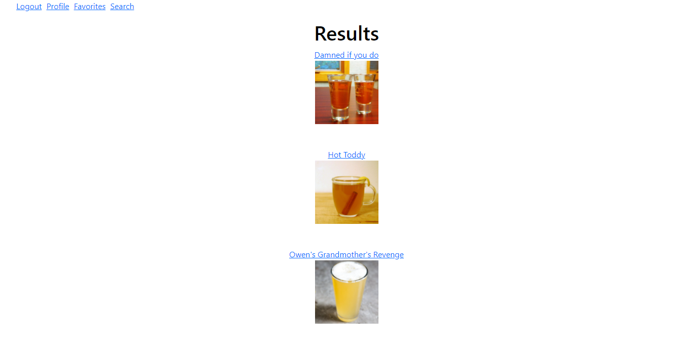
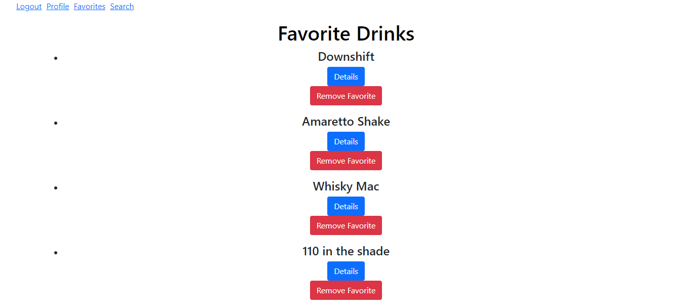

# LIQUOR LIST

Allows a user to search for drink recipes by ingredients they may have around the house.

# HOW TO USE

Create an account and begin exploring the recipes.

## Technologies Used

HTML, CSS, JavaScript, EJS, Sequelize, Postgres

## Search Results:



# HOW TO INSTALL

1. _`Fork`_ and _`Clone`_ this respository to your local machine
2. Open `index.html` in your browser to play or
3. Open the directory in your text editor of choice to view or edit the code

# HOW IT WORKS

Just search for an ingredient you want to be used within a cocktail. The results will list any drinks made using that ingredient!

## Favorites:



# Code Snippets

```app.get("/drinks/:idDrink", function (req, res) {
  let idDrink = req.params.idDrink;
  let drinkInfo = `http://www.thecocktaildb.com/api/json/v1/1/lookup.php?i=${idDrink}`;
  axios.get(drinkInfo).then((response) => {
    let ingArray = [];
    let drinkInfo = response.data.drinks[0];
    for (const [key, value] of Object.entries(drinkInfo)) {
      if (key.includes("strIngredient")) {
        ingArray.push(value);
      }
    }
    let amountArray = [];
    for (const [key, value] of Object.entries(drinkInfo)) {
      if (key.includes("strMeasure")) {
        amountArray.push(value);
      }
    }
    res.render("details", { drinkIngredient: ingArray, drinkInfo: response.data, drinkInstructions: amountArray });
  });
});
```

```app.post("/drinks/name/:name", function (req, res) {
  let drinkId = req.body.drinkId;
  let name = req.params.name;
  let drinkName = `http://www.thecocktaildb.com/api/json/v1/1/search.php?s=${name}`;
  axios.get(drinkName).then((response) => {
    let ingArray = [];
    let drinkInfo = response.data.drinks[0];
    for (const [key, value] of Object.entries(drinkInfo)) {
      if (key.includes("strIngredient")) {
        ingArray.push(value);
      }
    }
    let amountArray = [];
    for (const [key, value] of Object.entries(drinkInfo)) {
      if (key.includes("strMeasure")) {
        amountArray.push(value);
      }
    }
    db.note
      .findAll({
        where: {
          faveId: drinkId,
        },
      })
      .then((foundNotes) => {
        res.render("favesDetails", {
          drinkIngredient: ingArray,
          drinkInfo: response.data,
          drinkInstructions: amountArray,
          allNotes: foundNotes,
          drinkId: drinkId,
        });
      });
  });
});
```

```app.post("/faves", isLoggedIn, function (req, res) {
  let userInfo = req.user.get();
  db.faves
    .findOrCreate({
      where: {
        name: req.body.title,
        userId: userInfo.id,
      },
    })
    .then((createdFaves) => {
      res.redirect("/faves");
    });
});
```

# FUTURE CONSIDERATIONS

Adding mobile functionality, and Adding the ability to save a custom drink to your favorites.
